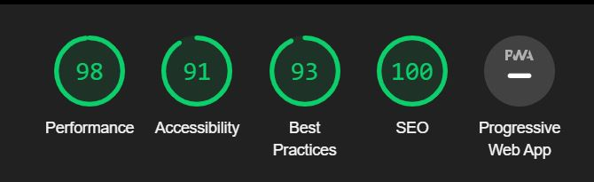
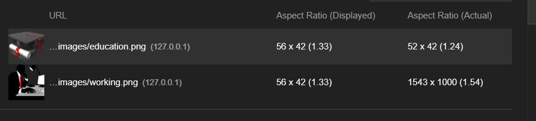
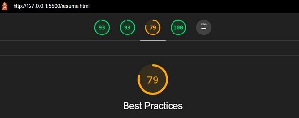
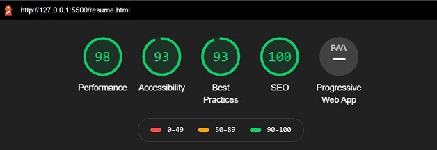

# Gediminas Valevicius Resume  

  

## UX

 

****

 
&nbsp;&nbsp;The Gediminas Valevicius Resume website was created as one of my assignments for Code Institute. I had the option to choose my own Idea for the project.  
I thought that the resume website could be useful not only to show my skills and pass the test but to use the website in the future for a potential employer. 
  I thought about the resume as a tool for marketing myself, so I have to think of what would be interesting for my potential employees to know. How to sell me.
  I looked for a lot of different resume websites online in order to learn from the other developers what they would consider as main, important points to showcase. I think it is important to learn from other people too. 
  &nbsp;&nbsp; During the research, I found out that it is most important for the employee to know your skills, to what projects you have contributed or worked on your own and resume itself. I decided that I am going to create a five-page website:

*  Home Page 
*  Resume Page 
*  Projects Page 
*  Skills Page 
* Contact Page
  
****

### Home Page  
&nbsp;&nbsp;The first page, home page I will dedicate as a short introduction about myself along with a picture. Like most good brands on the market, it has its slogan which helps to sell, attract customers, so I have to sell myself with a short paragraph about who I am and what I do for a living in order to get attention from a potential employer.  
&nbsp;&nbsp; Home Page’s header and footer, I am going to use for all other pages, so it will be created as a barebone for the entire website, only the content of the home page will be changed. In programming, reusability is very important, because of simplicity to test and coding in general.  
 

****

 

### Resume Page  
 
&nbsp;&nbsp;The resume page I decided to use for showcasing my Education and Experience.  I think the best way to display such information would be timelines. I found two potential sources on how to build timelines. One of which W3schools and another one is the bootstrap documentation. From this page, the user will be able to see my experience and education along with dates and short description of the position. 
 

****

 

### Projects Page  
&nbsp;&nbsp;The Projects page I am going to use in order to display projects I have created in the past. For the page, I am planning to use the bootstrap cards. Each card will be divided into two sections one is for the projected image and another one for its description. The description will show to the user what technologies I have used to implement a particular project.
 

****

 

### Skills Page  
&nbsp;&nbsp;The Skills page will be used to display my strongest skills along with skills that I had learned in college or during the work experience. For my strongest skills, I am planning to use the bootstrap progress bars along with the labels on the right side. The additional skills will be listed in the line. The key achievements I am planning to list using bootstrap rows and columns. The potential employer by looking at the page will be able to recognize my strongest skills. From the bootstrap progress bar, the user of the site will be able to see how much experience I have in a particular area. 
 

****

 

### Contact Page  
&nbsp;&nbsp; The contact page will be dedicated to a contact form and contact details. The contact form will be created using bootstrap and bootstrap javascript validation. The page will allow the potential employer to find contact details like phone number, my email address or the location where I am living. As well as that the user of my webpage will have an oportunity to contact me by using contact form and book a phone call if he needs. 

****

 

### Wireframes for each of the page on the site
* [Home](https://wireframe.cc/pro/pp/0801205c0338940)
* [Resume](https://wireframe.cc/pro/pp/81eb5d3d3338950)
* [Projects](https://wireframe.cc/pro/pp/f7029f065342644)
* [Skills](https://wireframe.cc/pro/pp/836bbaef8341165)
* [Contacts](https://wireframe.cc/pro/pp/ac20b1579342638)
 

****

 

### UML graphs
[Navigation Button](https://miro.com/app/board/o9J_ksemU64=/)
 
[Footer Icons](https://miro.com/app/board/o9J_ksemFzo=/)
 
****

## User Stories
 

### Navigation bar
* User - potential employer/recruiter
* Action - uses navigation bar
* Value - just in one click user can get to the information he/she is looking for.
  
### Footer
* User - potential employer/recruiter
* Action - uses the footer links
* Value - just in one click user gets to my social media, website source code or resume PDF.

### Home page
* User - potential employer/recruiter
* Action - opens the resume website
* Value - User will be introduced to the resume website. Short paragraph about me will show my goals and what area I have a keen interest to work as well as my persnal photo. From the main page it will be seen when I am an employee which they are looking for or when there is any point to brows the website.

### Resume page
* User - potential employer/recruiter
* Action - opens resume page.
* Value - by looking the resume page will be able to see my work experience and education.

### Resume page
* User - potential employer/recruiter
* Action - opens projects page.
* Value - by looking the projects page she/he will be able to see my projects I havew built during the studying software development.

### Skills page
* User - potential employer/recruiter
* Action - opens skills page.
* Value - by looking the skills page she/he will be able to see my strongest skills displayed in progress bars. It should look very informative as it displays not only the skill, but also the number of months or years I have had the experience for. From the additional skills the employer will be able to see that I have learned some extra skills and that I am not limiting my education to only one area.

### Contact page
* User - potential employer/recruiter
* Action - opens contact page.
* Value - user will be able to contact me in a way that suits him/her.
 1. The contact form will allow to write an email to me by using contact form.
 2. The contact details displayed on the right hand side of the contact form will allow to contact me by phone, email or just see the email in case they need it.
 3. Call sheduler link will bring the user to the "Calendly" to book a call at an appropriate time.

****
## Futures
****
 

### Existing Features
#### Informative
&nbsp;&nbsp; When I was creating the site I was always thinking about a potential employer, the area where I would like to work, how to make a website easy to use and informative.  Every page has its own purpose and is easy to understand from the navigation links, what information it holds.
  

#### Clear navigation
&nbsp;&nbsp; The website was created in mind that the user could get any information he needs in one click. Five links in the header area and four in the footer all of them are the same in all of the pages.  In order to make the user aware which page he is on, I have created headers for each page except the home page.  
  

#### Social media integration
 &nbsp;&nbsp; The user of the website in one click can get to my Facebook, Linkedin or Github accounts, as well as download my PDF CV. It can be achieved from any pages on the site because all the information is located in the footer area.
  

#### Contact information
&nbsp;&nbsp; Contact information gives ways to get in touch with me. I included many different ways of contacting me like phone, email, post, Facebook, Linkedin, Github. All this can be achieved in one click.
  

#### Mobile ready
&nbsp;&nbsp; The Resume website is responsive, it was built in mind that the user can open it on any device. During the development process I constantly tested it on various devices and browsers. 
  

****

#### Features Left to Implement
&nbsp;&nbsp; Another future idea would be to add an extra tab in the navigation bar for my blog page. Where I could post my thoughts, publish my pictures or hobbies. 
 That page would have to have a sign-in link for me to edit it and the page itself would display the content.
 

****

 

## Technologies Used
 
&nbsp;&nbsp; For the project I used HTML 5, CSS 3, JavaScript, jQuery and Bootstrap.
 

* HTML5 - used for evry page content.
* CSS3 - used for every page styling.
* JavaScript - at first I wrote a smole function for togle between two different navigation views, but in the end I removed it. Bootstrap uses javascript, jQuery for making grid responsive, as well as togle between desktop navigation and mobile.
*  

****

 

## Testing
 

****

 
All of my HTML pages I was testing by:

* [W3C - Markup Validation Service](https://validator.w3.org/)
* Using different browsers like Chrome, Firefox, Opera and Internet Explorer.
* Using all available sizes and layouts of the screens using Firefox and Chrome developer enviroments.

  
CSS style sheet "\assets\css\styles.css" by using:

* [W3C - CSS Validation Service](https://jigsaw.w3.org/css-validator/)
   
  &nbsp;By testing the stylesheet using the css validator I found one mistype:
   Value Error : font-size Unknown dimension 1.2emem 
  I fixed mistyped parameter and validator, didn't find any more errors. 

  
### Home Page testing.
&nbsp;&nbsp;CSS, HTML codes I had tested using “validator.W3.org”. During the test I found only one warning in HTML, it recommended to use the h1 heading in articles. 
During the testing on different browsers like Firefox, Chrome, Opera and Explorer I found out that Internet Explorer do not accept the background colour opacity with RGB colour coding as a fourth parameter. So, it ignores background colour with four parameters like: 
&nbsp;&nbsp;Background-color: rgb(12,12,12, 0.5); 
Instead it has to be written in rgba format. Like: 
&nbsp;&nbsp;Background-color: rgba(12,12,12,0.5); 
&nbsp;&nbsp;Another problem was that Internet Explorer do not accept a linear gradient value as a background colour. I found a code solution on Stack overflow: 
( https://stackoverflow.com/questions/4961651/does-ie9-support-css-linear-gradients ) 
I did run a test on the Chrome browser, in an audit section. The first result wasn’t good, but after some minor improvement I got very good result as you can see from the imgage down below.  

Test result:    

 

****

 

### Resume Page testing.  
&nbsp;&nbsp;The home page was created using only HTML, CSS and my own JS in order to show my coding skills. For all the other website pages, I thought I would be using Bootstrap, so all the other pages were supposed to use Bootstrap except the home page. Once I started using Bootstrap I noted that the alignment of my navigation bar was different comparing to the home page, so I changed my own version of the navigation bar to Bootstrap. So my final decision was to use Bootstrap navigatioin bar for all of the web pages. 
&nbsp;&nbsp;During the resume web page testing, I had discovered that the “Best Practice” parameter is very poor because of the image sizing. As you can see from the images below. 
  
  
&nbsp;&nbsp;I decided to resize the image to the required size, it would improve page rendering speed and the best practice parameter. As you can see from the image below the test result was improved.  

 &nbsp;Html Checker didn't found any errors : Document checking completed. No errors or warnings to show. 

****

 

### Projects Page testing.  
 &nbsp;&nbsp; HTML Checker didn't found any errors : Document checking completed. No errors or warnings to show. 

****
 

### Skills Page testing.  
 &nbsp;&nbsp; HTML Checker didn't found any errors : Document checking completed. No errors or warnings to show. 

****

### Contact Page testing
&nbsp;&nbsp; HTML Checker didn't found any errors : Document checking completed. No errors or warnings to show.

****
# Deployment
&nbsp;For the project deploymnet I used GitHub Pages and because I used GitHub since the begining of the project development it was very easy to set it up. The GitHub source control system is very handy tool. It allows only in a few clicks to publish the website.  &nbsp;In order to see the source code or to download and test localy it can be downloaded or pulled from GitHub. Even on the website it self I made a link to get access to the code. Any potential employer can not only see a visual part of the website, but to see the coding process by browsing my GitHub account.

  

# Credits

## Media

 

In order to use someone elses pictures, icons etc. you have to have a licence, but for this project, I was using only images that were free to use and a licence is not required. For example, "pngfuel" website states "Transparent cutout PNG images for designers, free & unlimited downloads".

 

The home image, background image was taken from: 
https://pixabay.com/images/search/ 
For the footer I was using the font awesome icons and I got them from the official font awesome website: 
https://fontawesome.com/  
All other images where taken from : 
https://www.pngfuel.com/search?q=programming+Languages

## Content
 &nbsp;All the content displayed on the website was my personal content and I didn't use any copied text from any external source. 

## Acknowledgements

 I received inspiration for this project from :
 * Code Institute labs. 
 * By browsing CV templates like - https://www.beautifullife.info/web-design/15-best-free-online-resumecv-website-templates-and-themes/
 * Personal world documnt CV.
 * FIT sugestions for building personal resume.

